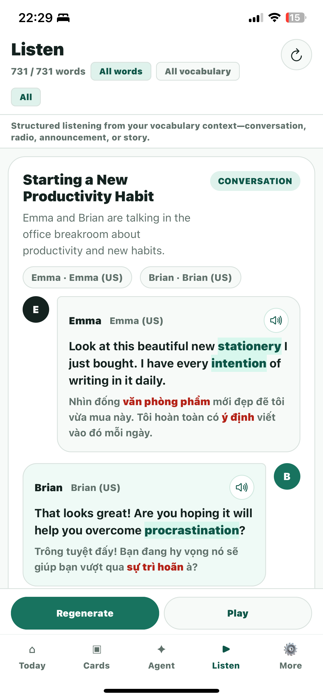
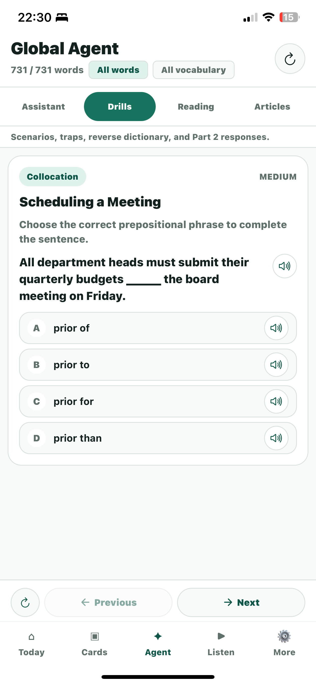
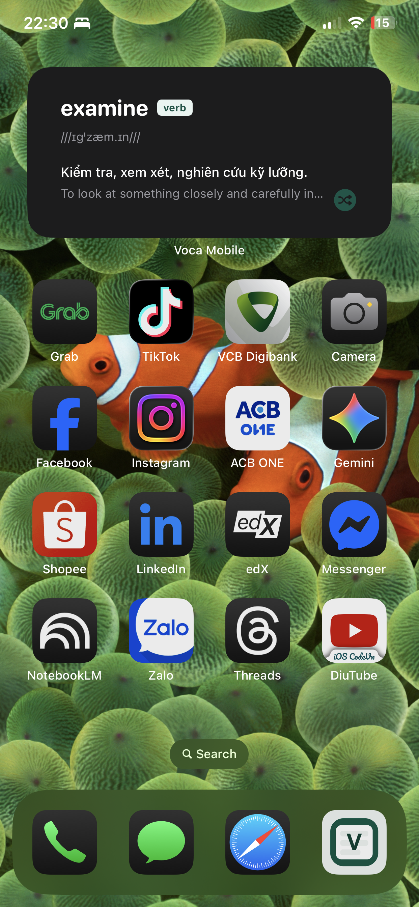

# Voca Dictionary

Bộ công cụ học từ vựng TOEIC tích hợp và chủ động gợi nhớ (active recall). Dự án kết hợp các ứng dụng web, di động (mobile), tiện ích mở rộng trình duyệt (extension) và ứng dụng macOS menubar để thu thập, khởi tạo và luyện tập từ vựng một cách liền mạch phục vụ nhu cầu học tập cá nhân.


## Bộ ứng dụng Voca (Voca Suite)

Hệ thống bao gồm 4 thành phần liên kết với nhau giúp xây dựng luồng học từ vựng liên tục:

- **Ứng dụng Web chính (`src/`)**: Giao diện React/Vite giúp quản lý các thẻ từ vựng, tìm kiếm nhanh và học tập qua Global AI Agent (Luyện tập, Đọc hiểu Part 6/7, Nghe hội thoại và Đọc báo).
- **Tiện ích mở rộng Trình duyệt (`extension/`)**: Tiện ích đồng hành trên Chrome/Edge giúp bạn bôi đen, dịch và lưu trực tiếp từ mới từ bất kỳ trang web nào vào cơ sở dữ liệu từ điển.
- **Ứng dụng macOS Menubar (`macos/`)**: Tiện ích chạy ngầm trên thanh công cụ macOS, chịu trách nhiệm khởi chạy Voca Local API Bridge để tự động kết xuất thẻ từ vựng PNG (sử dụng Playwright) và cache âm thanh TTS.
- **Ứng dụng Di động (`mobile/`)**: Ứng dụng Expo/React Native giúp xem các thẻ từ vựng, theo dõi cấp độ thẻ, truy vấn AI Assistant và hiển thị các widget từ vựng hàng ngày trực tiếp trên màn hình chính (Home Screen) của iPhone để học thụ động mọi lúc mọi nơi.

Tất cả các thành phần trên đều giao tiếp với **Local API Bridge** (cổng `22053`) để giữ cho cơ sở dữ liệu (`cards.json`) luôn được đồng bộ và cập nhật trên mọi thiết bị.

## Ảnh chụp màn hình (Screenshots)

### Giao diện Web (Desktop)


*Bảng điều khiển lưới từ vựng với tính năng lọc, xem chi tiết thẻ từ và lịch sử học*


*AI Agent toàn cục hỗ trợ bài tập đọc hiểu TOEIC, trắc nghiệm và luyện nghe hội thoại*

### Giao diện Di động (Mobile Companion App)

<p align="center">
  &nbsp;&nbsp;
  &nbsp;&nbsp;
  
</p>
<p align="center"><em>Từ trái qua phải: Danh sách từ vựng & Tìm kiếm, Chi tiết thẻ từ, và Giao diện tương tác với Global AI Assistant</em></p>

## Tính năng nổi bật

- **Lưới từ vựng**: Tìm kiếm/lọc theo cấp độ trạng thái (`new`, `learning`, `known`, `mastered`), các nhãn tự định nghĩa (tags), cùng tính năng in/xem trước ảnh PNG của thẻ từ.
- **Liên kết URL trực tiếp (Deep Linking)**: Truy cập hoặc lọc trực tiếp thẻ từ vựng bằng cách truyền tham số truy vấn `?q=từ_cần_tìm` trên URL. Trang web sẽ tự động chọn thẻ và tối ưu hóa lại thanh địa chỉ.
- **Phím tắt tiện lợi**: Điều hướng nhanh chóng bằng bàn phím để tối ưu tốc độ tra cứu và phát âm:
  - `/` hoặc `Cmd/Ctrl + K`: Tập trung (focus) vào ô tìm kiếm.
  - `Escape`: Xóa nhanh nội dung tìm kiếm hoặc bỏ chọn ô nhập liệu.
  - `Alt + V`, `Alt + P`, `Ctrl + Space` hoặc `\`: Phát âm thanh phát âm (TTS) cho từ đang chọn.
- **AI Assistant theo từng từ**: Trợ lý tương tác trực tiếp trên từng từ với giao diện Markdown và các câu đố phản xạ nhanh.
- **Global AI Agent**:
  - `Assistant`: Trợ lý học tập và giải đáp thắc mắc toàn cục trong ứng dụng.
  - `Drills`: Bộ bài tập TOEIC đa dạng (đoán từ qua nghĩa, tìm lỗi sai, bẫy từ vựng, xây dựng ngữ cảnh và luyện nghe Part 2).
  - `Reading`: Các bài tập đọc hiểu TOEIC Part 6 và Part 7 sinh tự động bằng AI, có kèm giải thích chi tiết và highlight ngữ cảnh.
  - `Article`: Luyện đọc các bài báo tin tức/kinh tế dài chứa các từ vựng đang học kèm câu hỏi kiểm tra đọc hiểu.
  - `Conversation` (Luyện nghe): Sinh các hội thoại tiếng Anh hàng ngày chứa bộ từ vựng của bạn. Phát âm thanh bằng các giọng đọc TTS khác nhau, hỗ trợ dịch nhanh khi di chuột qua từ và tự động tải trước các hội thoại tiếp theo ở chế độ nền.
- **Giao diện sáng/tối**: Hỗ trợ tự động chuyển đổi và lưu trạng thái Light/Dark mode theo hệ thống.
- **Bố cục linh hoạt**: Cho phép co giãn các cột chức năng và bảng Global Agent một cách trực quan.
- **Tạo thẻ từ vựng cục bộ**: Tích hợp côngử cụ `voca` để khởi tạo thẻ mới từ danh sách từ vựng cá nhân.

## Hướng dẫn sử dụng

### 1. Yêu cầu hệ thống

- **Node.js** phiên bản 22 trở lên & **npm**
- **Docker** (Không bắt buộc, dùng để chạy containerized environment)

### 2. Thiết lập dự án

Nhân bản kho lưu trữ (clone repository) và cài đặt các thư viện phụ thuộc:
```bash
git clone https://github.com/thaonv/voca-dictionary.git
cd voca-dictionary
npm install
```

*(Tùy chọn)* Sao chép file cấu hình mẫu để thiết lập các biến môi trường:
```bash
cp .env.example .env
```

---

## Phát triển (Development)

Bạn có thể chạy dự án bằng 2 cách:

### A. Chạy trực tiếp trên máy local (Khuyên dùng)

Để khởi động đồng thời cả Frontend Vite (chạy trên cổng `http://localhost:22052`) và Local API Bridge (chạy trên cổng `http://127.0.0.1:22053` để tạo thẻ và cache âm thanh TTS) trong cùng một cửa sổ terminal:
```bash
npm run dev:all
```
Lệnh này sẽ chạy song song `npm run voca:api` (cổng 22053) và Vite (cổng 22052).

Nếu bạn chỉ muốn chạy giao diện Frontend mà không cần API tạo thẻ:
```bash
npm run dev
```

*Lưu ý cho hệ điều hành Windows và các máy khác:* Lần đầu tiên chạy tính năng render thẻ sang PNG sẽ tự động tải Playwright Chromium vào thư mục tạm thời của hệ thống.

### B. Chạy bằng Docker Compose

Để build và chạy toàn bộ dịch vụ (giao diện web và API Bridge) qua Docker:
```bash
docker compose up -d --build
```
Hệ thống sẽ chạy cổng web `voca-dictionary` tại `127.0.0.1:22052` và cổng API `voca-bridge` tại `0.0.0.0:22053`.

---

## Đóng gói ứng dụng (Production Build)

Biên dịch TypeScript và xuất các tệp tin tĩnh tối ưu cho production:
```bash
npm run build
```
Các file sau khi build sẽ được lưu trữ trong thư mục `dist/`.

---

## Cấu hình & Biến môi trường

Các biến môi trường tùy chọn (có thể định nghĩa trong `.env`):

- `VITE_LOCAL_BRIDGE_ORIGIN` — URL gốc của bridge API dùng khi build (mặc định có thể cấu hình lại trong phần **Cài đặt → Local bridge** của giao diện web).
- `VOCA_API_TOKEN` — Token bảo mật dùng để giao tiếp với API Bridge. Nếu để trống, hệ thống sẽ sử dụng token mặc định trong `@voca/core/auth/token`.
- `VITE_VOCA_API_TOKEN` — Token dùng khi build web app. Nên đặt giá trị trùng với `VOCA_API_TOKEN`.
- `EXPO_PUBLIC_VOCA_API_TOKEN` — Token cấu hình cho ứng dụng di động khi build. Nên đặt giá trị trùng với `VOCA_API_TOKEN`.
- `VOCA_CARD_OUTPUT_DIR` — Thư mục xuất các ảnh thẻ từ vựng PNG trước khi đồng bộ vào `cards/` (Mặc định: `.voca-output/vocabulary_cards` trong thư mục gốc).

Tích hợp API cho app bên ngoài (ví dụ bilingual-app): xem [docs/integration.md](docs/integration.md).

CORS trên API Bridge phản chiếu header `Origin` của request — không cần cấu hình whitelist domain. Bảo mật dựa trên `VOCA_API_TOKEN`.

## Docker Compose (Web UI + API Bridge)

Hệ thống chạy **hai dịch vụ** với cấu hình nằm trong thư mục [docker/](file:///Users/thaonv/Projects/Personal/voca-dictionary/docker), tự động khởi động lại bằng cơ chế `restart: unless-stopped`:

| Tên Dịch vụ | Cổng ánh xạ | Vai trò |
|--------|----------------|------|
| `voca-dictionary` | `127.0.0.1:22052` | Đọc dữ liệu `cards.json` và thư mục `cards/` ở chế độ chỉ đọc (read-only) và phục vụ static web app qua `scripts/server.mjs`. |
| `voca-bridge` | `0.0.0.0:22053` | Chạy ứng dụng Node.js `voca-local-api` để hỗ trợ tạo thẻ, stream kết quả AI và lưu cache tệp tin âm thanh phát âm tại thư mục `audio/`. |

Mở ứng dụng tại địa chỉ:
```text
http://localhost:22052/
```

Khởi động hệ thống:
```bash
docker compose up -d --build
```

*Lưu ý:* Không chạy lệnh `npm run voca:api` trực tiếp trên máy chủ cùng lúc vì sẽ gây xung đột cổng **22053**. Với Compose, API Bridge chỉ cần chạy trong Docker.

Sau khi tạo thẻ từ vựng mới, vui lòng tải lại trang trình duyệt để cập nhật nội dung từ `cards.json` và thư mục `cards/`.

Tóm tắt thư mục Mount dữ liệu:
```yaml
./        -> /voca-data (Dịch vụ web: chỉ đọc; Dịch vụ bridge: đọc và ghi thẻ từ, tệp âm thanh, .voca-output, …)
```

## Các lệnh Scripts hỗ trợ

```bash
npm run dev:all        # Chạy đồng thời Vite + Local API Bridge (cổng 22052 + 22053)
npm run typecheck      # Kiểm tra lỗi TypeScript
npm run test           # Khởi chạy các unit test với Vitest
npm run build          # Đóng gói ứng dụng cho Production
npm run validate:data  # Kiểm định tính đồng nhất giữa cards.json và thư mục cards/
npm run gen:theme      # Khởi tạo lại bảng màu giao diện tại src/theme-colors.css
```

### Các tập lệnh tiện ích (`scripts/`)

- **`node scripts/server.mjs`**: Máy chủ web nhẹ phục vụ môi trường staging/production cục bộ.
- **`python scripts/import_csv_to_voca.py`**: Nhập hàng loạt từ vựng từ file danh sách dạng CSV vào hệ thống thẻ.
- **`node scripts/fill-missing-meanings.mjs`**: Tự động quét các thẻ từ thiếu nghĩa tiếng Anh/tiếng Việt trong `cards.json` và dùng LLM (OpenAI-compatible) để điền bổ sung nghĩa.

Lệnh kiểm tra toàn diện khuyên dùng trước khi thực hiện commit code mới:
```bash
npm run typecheck && npm run test && npm run build
```

## Dữ liệu và Các tệp tin Cục bộ

Các thư mục/tệp tin sau được cấu hình bỏ qua không theo dõi trên Git (untracked) để tránh làm nặng mã nguồn:

- `cards/`
- `cards.json`
- `audio/`
- `output/`
- `.voca-output/`
- `dist/`
- `node_modules/`

Cơ sở dữ liệu thẻ từ vựng được xác thực dựa trên schema tại `src/data/schema.ts`. Mỗi mục từ vựng chấp nhận các thuộc tính như `pronunciation`, `createdAt` và trạng thái `level`. Các cấp độ từ vựng được hỗ trợ gồm: `new` (mới), `learning` (đang học), `known` (đã biết) và `mastered` (đã thành thạo).

## Thêm thẻ từ vựng mới

Dự án này tích hợp bộ công cụ Voca Skill tại thư mục:
```text
skills/voca/
```

Các tệp tin quan trọng:
- `skills/voca/SKILL.md`
- `skills/voca/scripts/render_cards.js`
- `skills/voca/scripts/sync_dictionary.js`
- `skills/voca/README.md`

Đối với Codex trên máy mới, hãy cài đặt skill bằng cách chạy lệnh:
```bash
mkdir -p ~/.codex/skills
rm -rf ~/.codex/skills/voca
cp -R skills/voca ~/.codex/skills/voca
```

Đối với Claude, Cursor, Antigravity hoặc các AI Assistant khác, hãy hướng dẫn nó đọc tài liệu tại:
```text
skills/voca/SKILL.md
```

Khi chạy trong thư mục dự án này, sử dụng các script tương ứng:
```bash
node skills/voca/scripts/render_cards.js /tmp/voca-words.json ../output/vocabulary_cards
node skills/voca/scripts/sync_dictionary.js /tmp/voca-words.json ../output/vocabulary_cards .
```
Script đồng bộ sẽ kiểm tra tính hợp lệ của từ, slug, tên tệp tin để tránh sao chép trùng lặp. Các từ mới được thêm vào mặc định sẽ có trạng thái `level: "new"`.

## Cấu hình AI (AI Settings)

Bộ công cụ này tương thích hoàn toàn với các nhà cung cấp mô hình ngôn ngữ lớn (LLM) phổ biến hiện nay. Cấu hình AI được lưu trữ trực tiếp trên trình duyệt bằng `localStorage` (hoặc thông qua cấu hình biến môi trường của API Bridge):
- **Base URL (Địa chỉ API)**
- **API key (Khóa bảo mật)**
- **Model (Tên mô hình)**

### Các nhà cung cấp LLM được hỗ trợ tốt nhất:
- **OpenAI**: Sử dụng Base URL mặc định `https://api.openai.com/v1` cùng các mô hình phổ biến như `gpt-4o-mini`, `gpt-4o`.
- **Google Gemini (Qua tương thích OpenAI)**: Sử dụng Base URL `https://generativelanguage.googleapis.com/v1beta/openai/` cùng mã khóa API Gemini của bạn, hỗ trợ các mô hình như `gemini-1.5-flash`, `gemini-2.0-flash` hoặc `gemini-1.5-pro`.
- **Các nhà cung cấp tương thích khác**: Dễ dàng tích hợp với DeepSeek, OpenRouter, hoặc các mô hình chạy cục bộ (Offline) qua Ollama (Base URL mặc định `http://localhost:11434/v1`).

Cơ chế lưu trữ `localStorage` trên trình duyệt phù hợp cho môi trường sử dụng cá nhân cục bộ. Nếu bạn triển khai ứng dụng công khai cho nhiều người dùng, hãy đưa các cấu hình API Key này về lưu trữ an toàn ở phía Backend/Proxy.


## API Khởi tạo thẻ từ vựng cục bộ

Trình duyệt không thể chạy trực tiếp các tác vụ hệ thống (như ghi file hoặc chụp ảnh màn hình). Để giao diện Web có thể tạo thẻ tự động khi không tìm thấy từ, Local Bridge API phải được khởi chạy. Thông thường, bạn chỉ cần mở ứng dụng VocaMenuBar trên macOS để bridge này tự động chạy.

Khi phát triển giao diện web độc lập, chạy bridge song song qua lệnh `npm run dev:all` hoặc chạy riêng bridge bằng lệnh:
```bash
npm run voca:api
```

Giao diện Web sẽ gọi API `http://127.0.0.1:22053/create-card` truyền cấu hình AI, API Bridge sẽ thực hiện lệnh:
```bash
node skills/scripts/voca-create-card.mjs "<từ_cần_tạo>"
```
Thẻ từ vựng PNG mới tạo sẽ được đồng bộ vào thư mục `cards/`, file `cards.json` được cập nhật và ứng dụng web tự động tải lại dữ liệu mới nhất.

## Tiện ích mở rộng trình duyệt (Browser Extension)

Tiện ích mở rộng nằm trong thư mục:
```text
extension/
```

Hỗ trợ thu thập từ vựng từ mọi trang web đang đọc:
- **Thao tác nhanh**: Nhấp chuột phải vào từ hoặc cụm từ được chọn và chọn `Add "<word>" to Voca Dictionary`.
- **Tooltip tương tác**: Hiển thị bong bóng nhỏ nằm đè ngay trên từ được bôi đen với hiệu ứng scale-in mượt mà.
- **Trạng thái kết nối trực quan**: Hiển thị huy hiệu trạng thái kết nối tới Local Bridge API theo thời gian thực.
- **Tùy chỉnh hành vi**: Bật/tắt bong bóng hiển thị nhanh (`showBubble`) hoặc thông báo toast (`showToasts`) trực tiếp trong cài đặt tiện ích.
- **Kiểm tra kết nối**: Tích hợp nút kiểm tra nhanh API Bridge trong trang cấu hình tùy chọn.
- **Phím tắt nhanh**: Nhấn `Alt + Shift + V` để nhanh chóng lưu từ đang chọn.

Cài đặt thủ công tiện ích mở rộng:
1. Mở trang quản lý tiện ích: `chrome://extensions`
2. Bật chế độ dành cho nhà phát triển (**Developer mode**).
3. Chọn tải tiện ích đã giải nén (**Load unpacked**) và trỏ đến thư mục `extension/` của dự án này.

*Lưu ý:* Tiện ích có trang cài đặt riêng vì không thể đọc trực tiếp `localStorage` của Web App. Hãy nhập đúng thông tin Base URL, API key, Model và API Token giống với cài đặt trên Web App để tiện ích hoạt động ổn định.

## Cấu trúc thư mục mã nguồn

```text
src/App.tsx              Giao diện ứng dụng chính và luồng xử lý AI practice
src/styles.css           Định nghĩa giao diện, phong cách đọc báo/luyện nghe
src/theme-colors.css     Các biến màu sắc giao diện được sinh tự động
src/data/schema.ts       Định nghĩa cấu trúc dữ liệu thẻ từ vựng (Zod Schema)
src/data/search.ts       Hàm hỗ trợ tìm kiếm và lọc từ vựng
src/hooks/useManifest.ts Hook xử lý tải dữ liệu cards.json
src/lib/storage.ts       Hàm tiện ích tương tác với localStorage
scripts/                 Thư mục chứa các script hỗ trợ (server.mjs, import_csv_to_voca.py, fill-missing-meanings.mjs)
docker/                  Thư mục cấu hình Docker và Nginx (Dockerfile, Dockerfile.bridge, nginx.conf)
extension/               Mã nguồn tiện ích mở rộng trình duyệt Chrome/Edge
skills/voca/             Bộ kỹ năng Voca tích hợp (Voca skill bundle)
```

## Ghi chú cho AI Agents phát triển sau

- Ưu tiên sử dụng lệnh `rg` (ripgrep) để tìm kiếm nội dung trong mã nguồn.
- Không tự động commit dữ liệu thẻ từ vựng hoặc file âm thanh cục bộ phát sinh lên Git.
- Duy trì kiến trúc ứng dụng Frontend-only ngoại trừ các chức năng bắt buộc cần API Bridge.
- Giữ nguyên cấu hình cổng Docker `22052` (chạy Web) và `22053` (chạy Bridge), được ánh xạ tới localhost `127.0.0.1` của máy chủ.
- Sau khi chỉnh sửa UI hoặc code TypeScript, chạy lệnh kiểm tra: `npm run typecheck && npm run test && npm run build`.
- Sau khi sửa đổi các tệp cấu hình ảnh hưởng đến Docker, chạy lại: `docker compose up -d --build`.

## Tác giả — Author

- **thaonv** ([@thaonv7995](https://github.com/thaonv7995)) · [thaonv@thaonv.site](mailto:thaonv795@gmail.com)
- Mã nguồn dự án: [github.com/thaonv7995/voca-dictionary](https://github.com/thaonv7995/voca-dictionary)
